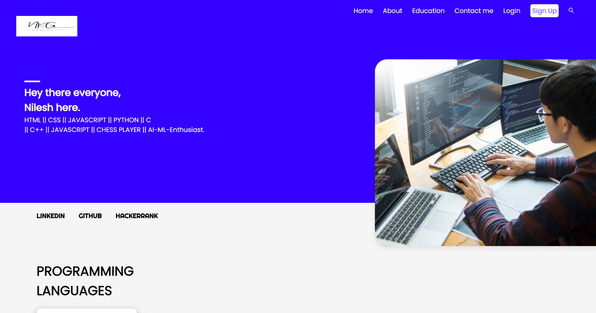
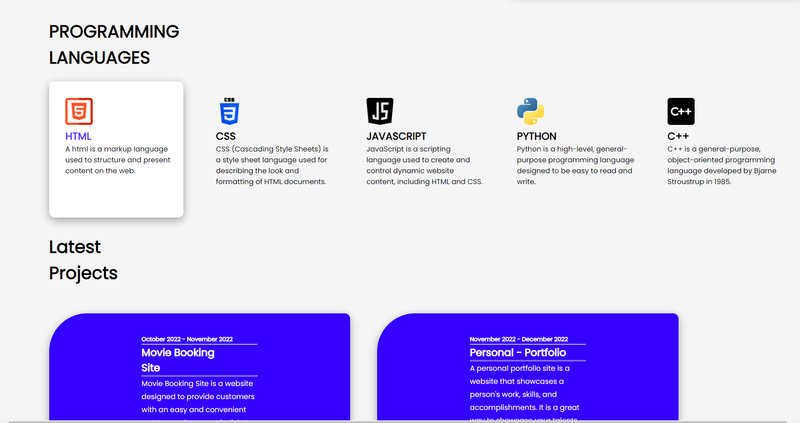
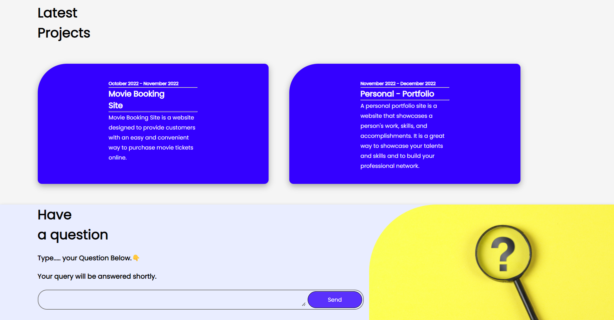
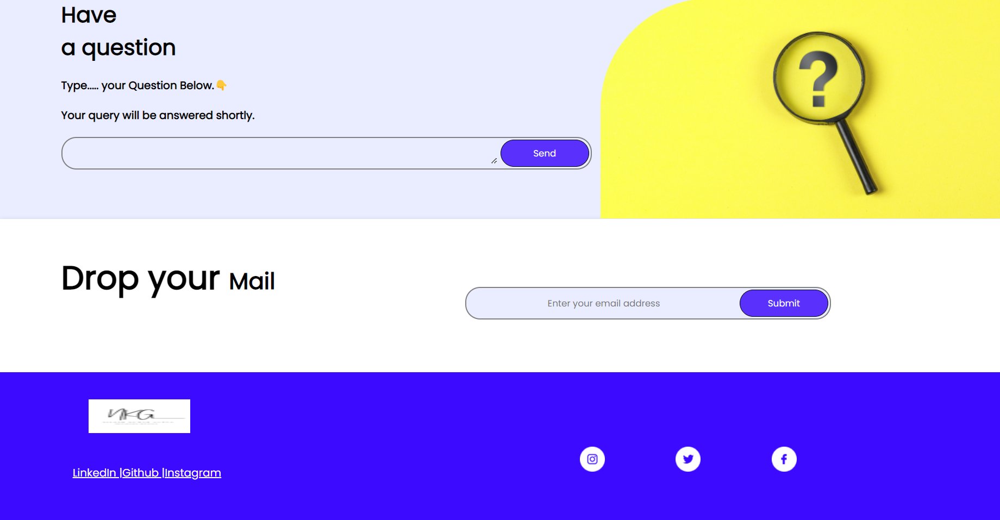
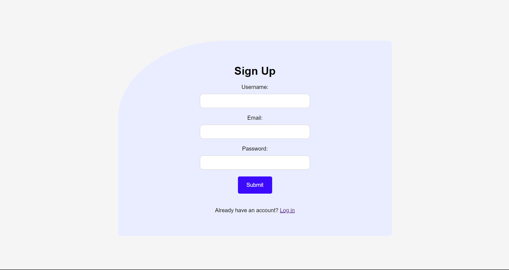
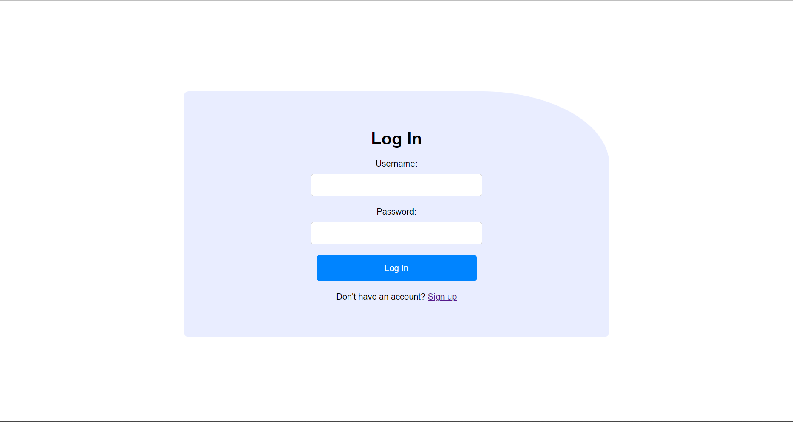
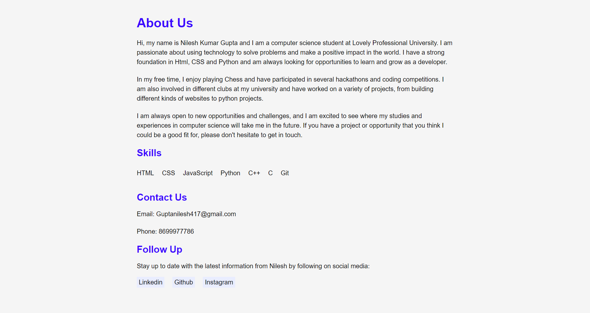

# Personal Portfolio
<h2 align="center">Hi 👋, I'm Nilesh Kumar Gupta</h2> <br>
<h3>A passionate Programmer from India.
This is my personal portfolio website.</h3>

<br>
&nbsp;&nbsp;&nbsp;&nbsp;&nbsp;<a href="https://github.com/Nilesh220"></a>
 <br> <br>


<p>&nbsp;&nbsp;&nbsp;&nbsp;&nbsp;  </p>

***

## Screenshots of website











```python
print("Hello I am Nilesh🙋‍♂️.")
```
```python
print("Nice to meet you. see you soon")
```
```python
print("Show some ❤️ to my Repositories.")
```


